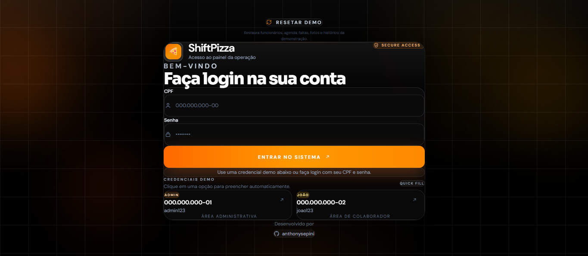
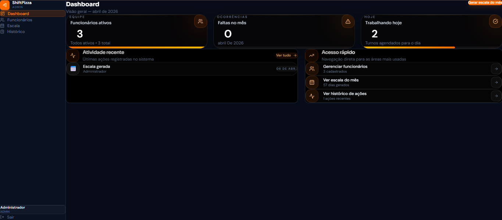
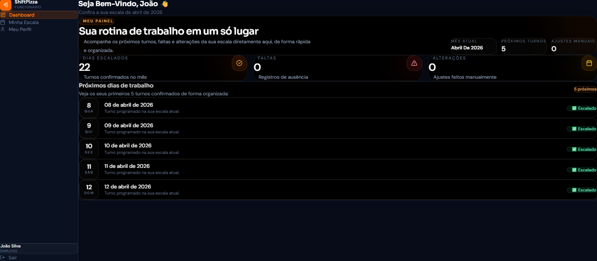

<div align="center">

# 🍕 ShiftPizza

**Employee and schedule management for small businesses — built because WhatsApp groups aren't systems.**

[](https://shiftpizza.vercel.app)
[](LICENSE)


</div>

---

## What this is

Most small businesses still track team schedules through a WhatsApp group and a notepad. Someone doesn't show up because they saw a different message. Someone works an extra shift that nobody recorded. Vacations disappear.

ShiftPizza replaces that. Admins manage the full team — schedules, absences, extra shifts, vacations — and each employee gets their own dashboard to check their own data. No group chat. No paper.

The demo resets on demand, so you can break it as many times as you want.

**[→ Try it at shiftpizza.vercel.app](https://shiftpizza.vercel.app)** — credentials are right on the login screen.

---

## Preview

<div align="center">


</div>

---

## Screenshots

| Login | Admin Dashboard | Employee Dashboard |
|:---:|:---:|:---:|
|  |  |  |

---

## What it does

**Admin**
- Register, edit, and remove employees (name, CPF, phone, role, password)
- Generate and manage monthly schedules
- Log absences and extra shifts
- Control vacation periods
- View a real-time activity feed
- Reset the entire demo environment without redeploying

**Employee**
- See their own schedule and upcoming shifts
- View their absence history
- Access their own profile data

---

## Technical decisions

**Why NestJS?** I wanted a backend with actual structure — modules, guards, decorators, dependency injection — not a flat Express app with everything in one file. NestJS forces you to organize things.

**Why Argon2 over bcrypt?** Argon2 is more resistant to GPU-based brute-force attacks. It's what OWASP recommends now. The extra setup was worth it.

**Why Neon for PostgreSQL?** Serverless database that doesn't have cold-start problems on the free tier. I didn't want to manage a VPS just to keep a demo alive.

**Why a server-side reset button?** I didn't want to redeploy every time someone wiped the seed data while testing. The reset endpoint re-runs the seeder on demand — the admin panel has a button for it.

---

## Tech stack

**Frontend**
-  React
-  Vite
-  TypeScript
-  Tailwind CSS
-  CSS
-  Axios
-  React Router DOM

**Backend**
-  NestJS
-  TypeScript
-  Prisma ORM
-  Node.js
-  JWT
-  class-validator
-  Argon2

**Infrastructure**
-  PostgreSQL
-  Neon
-  HTML
-  npm


---

## Architecture

```
shiftpizza/
├── frontend/
│   └── src/
│       ├── components/     # Reusable UI components
│       ├── pages/          # Route-level views
│       ├── services/       # Axios API calls per domain
│       └── context/        # Auth context with role awareness
│
└── backend/
    ├── src/
    │   ├── auth/           # JWT strategy, login, role guards
    │   ├── employees/      # CRUD + DTO validation
    │   ├── schedules/      # Monthly schedule generation
    │   ├── shifts/         # Shift and absence management
    │   └── prisma/         # Shared PrismaService
    └── prisma/
        ├── schema.prisma
        └── seed.ts
```

---

## Running locally

**Backend**

```bash
cd backend
npm install
cp .env.example .env     # DATABASE_URL and JWT_SECRET
npx prisma migrate dev
npx prisma db seed
npm run start:dev
```

**Frontend**

```bash
cd frontend
npm install
cp .env.example .env     # VITE_API_URL
npm run dev
```

---

## Author

<table>
  <tr>
    <td>
      <strong>Anthony Diniz Sepini Azevedo</strong><br/>
      Full stack developer. I like real problems, clean architecture, and code that still works when someone actually uses it.
      <br/><br/>
      <a href="https://github.com/anthonysepini">
        
      </a>
      &nbsp;
      <a href="https://www.linkedin.com/in/anthonysepini">
        
      </a>
    </td>
  </tr>
</table>
