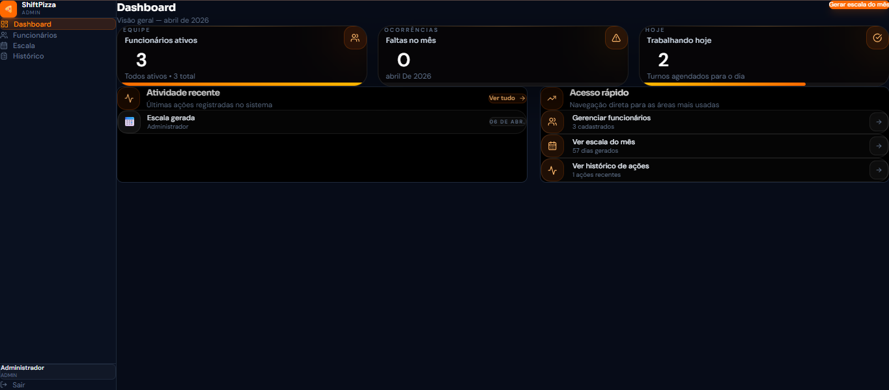
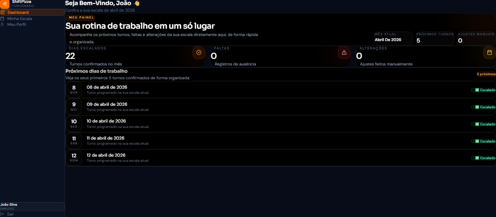

[](https://github.com/anthonysepini/ShiftPizza/actions/workflows/ci.yml)

<div align="center">

# ShiftPizza

**Role-aware employee and monthly schedule management for small teams.**

[](LICENSE)


</div>

ShiftPizza replaces informal schedule tracking with an authenticated web application. Administrators maintain employees, weekly work rules, monthly schedules, and schedule exceptions. Employees can access only their own profile and schedule.

The repository contains two independently installed applications. There is no root package runner.

## Product scope

Administrators can:

- create, edit, activate, deactivate, and delete employees;
- define recurring weekdays for each employee;
- generate a month from the active employees' weekly rules;
- mark a generated day as scheduled, absent, extra shift, day off, or removed;
- inspect audit entries produced by schedule generation and manual day changes.

Employees can:

- see their own monthly schedule and summary;
- see their own profile;
- use the employee routes without receiving access to administrator data.

ShiftPizza does not currently model payroll, clock-in/clock-out attendance, or vacation as separate domain concepts. A past scheduled day must not be interpreted as proof of attendance.

## Preview

<div align="center">


</div>

| Login | Administrator dashboard | Employee dashboard |
|:---:|:---:|:---:|
|  |  |  |

## Architecture

```text
shiftpizza/
├── frontend/                         React 19 + Vite 8 SPA
│   ├── e2e/                          Playwright browser checks
│   └── src/
│       ├── app/                      Route composition
│       ├── components/               Layout and reusable UI primitives
│       ├── features/                 Authentication and schedule policies
│       ├── pages/                    Administrator and employee screens
│       ├── services/                 Typed Axios API adapters
│       ├── types/                    Shared frontend domain types
│       └── utils/                    Civil-date handling
├── backend/                          NestJS 11 REST API
│   ├── prisma/                       Prisma schema, migrations, and demo seed
│   ├── src/
│   │   ├── common/                   Guards, filters, pipes, and date helpers
│   │   ├── config/                   Environment validation
│   │   ├── modules/                  Auth, employees, schedules, audit, demo, health
│   │   └── prisma/                   Shared Prisma client lifecycle
│   └── test/                         HTTP integration tests
└── docs/superpowers/                 Refactor design and execution plan
```

The browser uses bearer JWT authentication. The API revalidates the user and active-employee state for authenticated requests, and administrator operations are protected by server-side role guards. Client-side route guards improve navigation but are not the authorization boundary.

## Prerequisites

- Node.js `20.19+`, `22.12+`, or `24+` (the supported backend engine ranges)
- npm, using the committed lockfiles
- PostgreSQL reachable from the backend

Use a local, disposable database while developing. Before any Prisma migration or seed command, verify that `DATABASE_URL` does not point to a shared, staging, or production database.

## Safe local setup

### 1. Backend

```powershell
cd backend
npm ci
Copy-Item .env.example .env
```

Edit `backend/.env` locally. Never commit it. On a new disposable local database, apply the existing migrations and optionally load the demo records:

```powershell
npx prisma validate
npx prisma generate
npx prisma migrate deploy
npx prisma db seed
npm run start:dev
```

The seed is intended only for a disposable demo database and creates known demonstration credentials. Do not use those accounts in a shared or production environment.

The API defaults to `http://localhost:3000`; its health endpoint is `/health`, and Swagger UI is available at `/api` while the application is running.

### 2. Frontend

In another terminal:

```powershell
cd frontend
npm ci
npx playwright install chromium
Copy-Item .env.example .env.local
npm run dev
```

Vite prints the local application URL. `VITE_API_URL` must identify the backend origin and must not contain credentials or secrets.

## Environment contract

| Application | Variable | Requirement |
|---|---|---|
| Backend | `DATABASE_URL` | Required PostgreSQL connection string; keep it secret. |
| Backend | `JWT_SECRET` | Required, at least 32 characters; use a cryptographically random secret. |
| Backend | `CORS_ORIGIN` | Comma-separated browser origins; required in production and restricted to local Vite origins by default in development. |
| Backend | `BUSINESS_TIME_ZONE` | IANA timezone used for the current business day; defaults to `America/Sao_Paulo`. |
| Backend | `APP_MODE` | `standard` by default. `isolated-demo` explicitly marks a disposable demo deployment. |
| Backend | `DEMO_RESET_ENABLED` | Optional boolean. It is `false` unless explicitly enabled. |
| Backend | `PORT` | Optional API port; defaults to `3000`. |
| Frontend | `VITE_API_URL` | Public backend base URL. Vite exposes this value to the browser. |

Only placeholder values belong in `.env.example` files. Any variable prefixed with `VITE_` is bundled into browser code and cannot be treated as a secret.

## Demo reset safety

`GET /demo/status` reports whether reset is available. `POST /demo/reset` is hidden with a `404` while `DEMO_RESET_ENABLED=false`, which is the default.

Startup accepts `DEMO_RESET_ENABLED=true` only together with `APP_MODE=isolated-demo`. That explicit combination makes a destructive, unauthenticated demo endpoint available: it deletes all application employees, users, rules, schedules, and audit entries before restoring the known seed records. Use it only with an isolated, disposable database, never with shared or durable data.

## Authorization summary

| Capability | Public | Employee | Administrator |
|---|:---:|:---:|:---:|
| Health, login, and demo-status checks | Yes | Yes | Yes |
| Read own employee profile | No | Yes | Yes |
| Read own monthly schedule | No | Yes | Yes |
| Manage employees | No | No | Yes |
| Generate/read all schedules and update days | No | No | Yes |
| Read audit history | No | No | Yes |

Login attempts are rate-limited, passwords are hashed with Argon2, request DTOs reject unknown fields, CORS uses an allowlist, and baseline HTTP security headers are applied by the API.

## Quality checks

Run each group from its own application directory.

Frontend:

```powershell
npm run lint
npm run test:run
npm run build
npm run test:e2e
```

Dedicated automated accessibility; The Playwright suite includes automated accessibility and responsive checks
with axe-core across desktop, tablet, and mobile viewports. Manual keyboard
and visual review remains part of release validation:

```powershell
cd frontend

npm ci
npm run lint
npm run test:run
npm run build
npm run test:a11y
npm run test:e2e
```

Backend:

```powershell
npx eslint "{src,apps,libs,test}/**/*.ts"
npm test -- --runInBand
npm run test:e2e -- --runInBand
npm run build
npx prisma validate
npx prisma generate
```

Both applications run read-only lint checks with `npm run lint`. The backend exposes `npm run lint:fix` separately for explicitly authorized rewrites.

Tests do not authorize a real database reset. The backend HTTP tests replace the Prisma provider and verify health, validation, security headers, login throttling, and the disabled-by-default reset boundary without mutating database data.

## Database change policy

- Develop and verify migrations against a disposable local PostgreSQL database first.
- Review generated SQL before applying it anywhere outside local development.
- Never run `prisma migrate reset`, the demo reset endpoint, or the seed against shared data.
- Treat deployment and remote database changes as separate, explicitly approved operations.

## License

[MIT](LICENSE)
